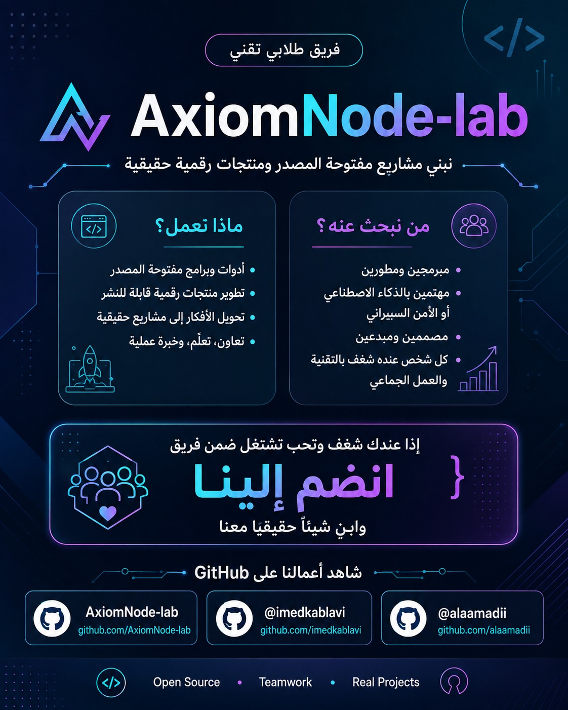
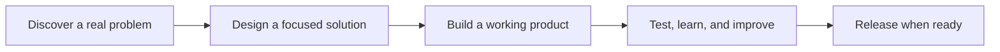

  

   
   

  
  
  

  **Turning ambitious ideas into useful, reliable digital products.**

  *نحوّل الأفكار الطموحة إلى منتجات رقمية مفيدة وموثوقة.*

---

## About Us

**AxiomNode Lab** is a student-led technology team focused on learning through building. We design and develop practical software, intelligent tools, and open-source solutions while growing through collaboration, experimentation, and real project experience.

We believe strong products begin with a clear problem, thoughtful engineering, continuous testing, and a team that learns together.

> Some of our projects remain private while they are under active development. We share them publicly only when they are ready.

## What We Build

| 🧠 Intelligent Systems | 💻 Software Products | 🌍 Open Source | 🔐 Secure Engineering |
| :---: | :---: | :---: | :---: |
| Practical AI-powered tools | Useful and scalable applications | Reusable tools for developers | Privacy-aware, dependable software |

Our interests include:

- Artificial intelligence and developer tools
- Full-stack applications and digital products
- Automation, testing, and reliable delivery
- Open-source collaboration and shared learning

## How We Work

Every project follows four principles:

| Principle | What it means to us |
| --- | --- |
| **Build with purpose** | Start with a real problem and a clear outcome. |
| **Learn by doing** | Turn knowledge into working, testable software. |
| **Collaborate openly** | Share responsibility, feedback, and credit. |
| **Improve continuously** | Treat every version as an opportunity to learn. |

## Meet the Co-Founders

| Co-Founder | GitHub | Focus |
| --- | --- | --- |
| **Alaa Madi** | [@alaamadii](https://github.com/alaamadii) | Product development, AI, and software engineering |
| **Imed Kablavi** | [@imedkablavi](https://github.com/imedkablavi) | Product development and software engineering |

Both founders share ownership of the organization and collaborate across planning, development, review, and product decisions.

## Collaborate With Us

We welcome developers, designers, and curious builders who value practical learning, teamwork, and meaningful technology.

You can:

- Explore our public repositories as they become available
- Open an issue or discussion in the relevant public repository
- Connect with either co-founder through GitHub

  
  
  

---

<strong>نبذة بالعربية</strong>

### من نحن؟

**AxiomNode Lab** فريق طلابي تقني نتعلّم من خلال بناء منتجات حقيقية. نهتم بتطوير البرمجيات، والأدوات الذكية، والمشاريع مفتوحة المصدر، مع التركيز على التعاون والتجربة والتحسين المستمر.

نبدأ من مشكلة حقيقية، نصمّم حلًا واضحًا، نبني نسخة عملية، ثم نختبرها ونطوّرها حتى تصبح جاهزة للنشر.

> تبقى بعض مشاريعنا خاصة خلال مرحلة التطوير، ولا ننشرها إلا عندما تصبح جاهزة.

### المؤسسون

- **علاء ماضي** — مؤسس مشارك — [@alaamadii](https://github.com/alaamadii)
- **عماد قبلاوي** — مؤسس مشارك — [@imedkablavi](https://github.com/imedkablavi)

### انضم إلى رحلتنا

نرحّب بالمبرمجين والمصممين وكل شخص لديه شغف بالتقنية والعمل الجماعي. يمكن التواصل معنا من خلال حساباتنا على GitHub أو المشاركة في مستودعاتنا العامة عندما تصبح متاحة.

  Code with purpose · Build with care · Grow together

