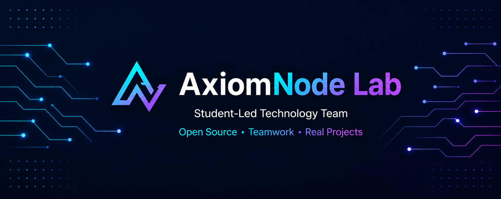

  

**Open Source · Teamwork · Real Projects**

We build open-source tools and practical digital products while learning, collaborating, and growing together.

**نبني أدوات مفتوحة المصدر ومنتجات رقمية حقيقية من خلال التعلّم والتعاون والعمل الجماعي.**

---

## About AxiomNode Lab

**AxiomNode Lab** is a student-led technology team created by developers who believe that the best way to learn technology is to build with it.

We turn ideas into practical software, experiment with modern technologies, and work together on projects that solve real problems.

Our goal is not only to write code, but also to gain real experience in planning, product development, testing, collaboration, and continuous improvement.

> Some of our projects remain private while they are under active development. We publish projects and technical details only when they are ready to be shared.

## What We Do

| Area | Our Work |
| --- | --- |
| **Open-Source Development** | Build useful tools and reusable software that can benefit developers and communities. |
| **Digital Products** | Develop practical applications designed to become reliable, publishable products. |
| **Ideas to Projects** | Transform technical ideas into structured, testable, and working solutions. |
| **Learning by Building** | Develop our skills through implementation, teamwork, feedback, and experimentation. |
| **Collaborative Engineering** | Share planning, development, reviews, decisions, and credit across the team. |

## Our Interests

We are especially interested in:

- Software engineering and full-stack development
- Artificial intelligence and intelligent systems
- Cybersecurity and privacy-aware engineering
- Developer tools and automation
- Product design and user experience
- Testing, reliability, and continuous improvement
- Open-source collaboration

## How We Work

Our projects generally follow this process:

1. **Identify a real problem** and understand who it affects.
2. **Shape the idea** into a focused and achievable solution.
3. **Plan the work** and divide responsibilities clearly.
4. **Build a working product** using appropriate technologies.
5. **Test and review** the result as a team.
6. **Improve continuously** based on evidence and feedback.
7. **Share when ready** without exposing unfinished or private work.

## Our Principles

- **Purpose before complexity:** We build around real needs instead of unnecessary features.
- **Learning through practice:** Every project should create meaningful practical experience.
- **Shared ownership:** Responsibility, decisions, and recognition belong to the team.
- **Quality matters:** Testing, documentation, security, and maintainability are part of development.
- **Privacy during development:** Unfinished projects remain private until the team decides they are ready.
- **Continuous improvement:** We learn from every version, challenge, and result.

## Who Can Collaborate With Us?

We welcome motivated people who enjoy building and learning, including:

- Programmers and software developers
- People interested in artificial intelligence or cybersecurity
- Designers and creative problem-solvers
- Contributors who value teamwork and clear communication
- Students who want practical experience through real projects

You do not need to know everything. Curiosity, commitment, respectful collaboration, and a willingness to learn are what matter most.

## Co-Founders

| Co-Founder | GitHub | Role |
| --- | --- | --- |
| **Alaa Madi** | [@alaamadii](https://github.com/alaamadii) | Co-Founder |
| **Imed Kablavi** | [@imedkablavi](https://github.com/imedkablavi) | Co-Founder |

Both co-founders share ownership of AxiomNode Lab and collaborate on planning, development, reviews, and product decisions.

## Collaborate With Us

As our public work becomes available, you can:

- Explore our public repositories
- Contribute through issues and pull requests
- Suggest ideas and improvements
- Connect with the co-founders through GitHub

> If you are passionate about technology and want to help build something meaningful with a team, you are welcome to follow our work and reach out.

---

## نبذة بالعربية

**AxiomNode Lab** فريق طلابي تقني تأسس على فكرة بسيطة: أفضل طريقة لتعلّم التقنية هي استخدامها في بناء مشاريع حقيقية.

نعمل معًا على تطوير أدوات وبرامج مفتوحة المصدر، وبناء منتجات رقمية قابلة للنشر والتوسع، وتحويل الأفكار التقنية إلى حلول عملية يمكن اختبارها وتحسينها.

هدفنا لا يقتصر على كتابة الكود، بل يشمل اكتساب خبرة حقيقية في التخطيط، وتطوير المنتجات، والاختبار، والتعاون، ومراجعة العمل.

تبقى بعض مشاريعنا خاصة خلال مرحلة التطوير، ولا ننشرها أو نكشف تفاصيلها إلا عندما يقرر الفريق أنها أصبحت جاهزة.

### ماذا نعمل؟

- نطوّر أدوات وبرامج مفتوحة المصدر.
- نبني منتجات رقمية عملية وقابلة للتطوير.
- نحوّل الأفكار إلى مشاريع حقيقية ومنظمة.
- نتعلّم من خلال التطبيق والتجربة.
- نتعاون في التخطيط والبرمجة والمراجعة واتخاذ القرارات.
- نهتم بجودة البرمجيات والاختبارات والأمان والتوثيق.

### مجالات اهتمامنا

- هندسة البرمجيات وتطوير التطبيقات.
- الذكاء الاصطناعي والأنظمة الذكية.
- الأمن السيبراني والخصوصية.
- أدوات المطورين والأتمتة.
- تصميم المنتجات وتجربة المستخدم.
- الاختبارات وجودة البرمجيات.
- المشاريع مفتوحة المصدر.

### مبادئنا

- نبدأ من مشكلة حقيقية وهدف واضح.
- نتعلّم من خلال التطبيق العملي.
- نتشارك المسؤوليات والقرارات والتقدير.
- نهتم بالجودة والأمان وقابلية صيانة البرمجيات.
- نحافظ على خصوصية المشاريع خلال مرحلة التطوير.
- نراجع عملنا ونعمل على تحسينه باستمرار.

### من يمكنه التعاون معنا؟

نرحّب بـ:

- المبرمجين ومطوري البرمجيات.
- المهتمين بالذكاء الاصطناعي أو الأمن السيبراني.
- المصممين وأصحاب الأفكار الإبداعية.
- الطلاب الراغبين في اكتساب خبرة عملية.
- كل شخص لديه شغف بالتقنية والعمل الجماعي والتعلّم.

ليس المطلوب أن تعرف كل شيء؛ الأهم هو الالتزام، وحب التعلّم، والتواصل الواضح، واحترام العمل الجماعي.

### المؤسسون المشاركون

- **Imed Kablavi** — [@imedkablavi](https://github.com/imedkablavi)
- **Alaa Madi** — [@alaamadii](https://github.com/alaamadii)

إذا كنت مهتمًا بالتعاون معنا، يمكنك متابعة مستودعات المنظمة العامة والتواصل مع المؤسسين من خلال GitHub.

---

**Code with purpose · Build with care · Grow together**

